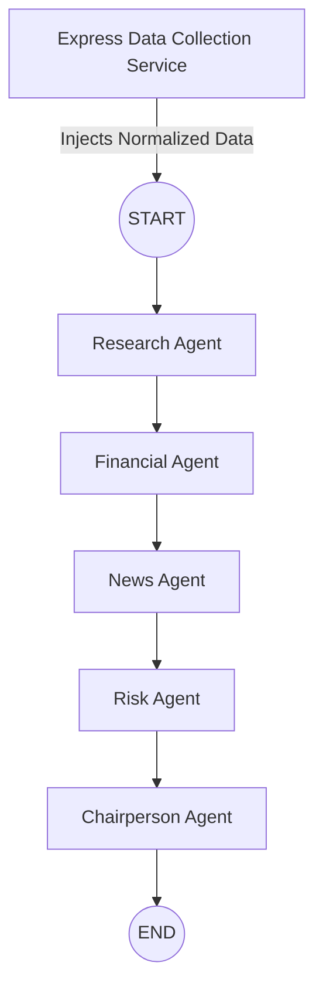

# AlphaLens AI: LangGraph Workflow Design

## 1. Workflow Philosophy
To enforce strict separation of concerns, **data collection is completely decoupled from AI analysis**. Instead of LangGraph agents making external API calls directly, the Express backend fetches all external data (Yahoo Finance, NewsAPI, Tavily) *before* invoking LangGraph. The LangGraph agents act purely as analytical reasoning engines, receiving pre-fetched, normalized data in their initial state. This prevents agents from crashing due to external API timeouts, drastically simplifies graph logic, and makes testing significantly easier.

---

## 2. Shared State Design
The LangGraph State is a comprehensive JSON object that serves as the single source of truth, evolving as it passes through the workflow.

*   `ticker` (String): The input stock symbol.
*   `company` (Object): Pre-fetched company profile data.
*   `marketData` (Object): Pre-fetched quantitative Yahoo Finance data.
*   `news` (Array): Pre-fetched news articles.
*   `researchSummary` (Object): Agent output (businessModel, sector, industry).
*   `financialAnalysis` (Object): Agent output analyzing marketData.
*   `newsAnalysis` (Object): Agent output analyzing news sentiment.
*   `riskAnalysis` (Object): Agent output detailing strict headwinds/bear case.
*   `recommendation` (String): Final verdict (Buy/Hold/Sell).
*   `confidence` (Number): 0-100 confidence score.
*   `reasoning` (String): High-level summary of the verdict.
*   `sections` (Object): Structured JSON chunks representing the final report.
*   `citations` (Array): Final array of sources used.
*   `agents` (Array of Objects): Directly powers the UI status tracker. Example: `{ "name": "Research", "status": "completed", "duration": 4, "evidence": 7 }`.
*   `debugLogs` (Array of Strings): Internal logs used purely for backend debugging, not for UI display.
*   `errors` (Array of Strings): Tracks non-fatal API/AI failures.

---

## 3. Agent Definitions

### 1. Research Agent
*   **Purpose:** To define the company context.
*   **Input:** `company`
*   **Output:** `researchSummary` (companySummary, businessModel, sector, industry)
*   **Responsibilities:** Reads raw profile data and outputs a highly structured corporate overview.
*   **Failure behavior:** Appends to `errors` and `debugLogs`.

### 2. Financial Agent
*   **Purpose:** To analyze quantitative health.
*   **Input:** `marketData`
*   **Output:** `financialAnalysis`
*   **Responsibilities:** Interprets the pre-fetched metrics to determine financial strength.
*   **Failure behavior:** Appends to `errors`, returns a neutral financial outlook.

### 3. News Agent
*   **Purpose:** To synthesize market sentiment.
*   **Input:** `news`
*   **Output:** `newsAnalysis`
*   **Responsibilities:** Reads the pre-fetched articles and summarizes current qualitative sentiment.
*   **Failure behavior:** Appends to `errors`, returns neutral sentiment.

### 4. Risk Agent
*   **Purpose:** The "Devil's Advocate."
*   **Input:** `financialAnalysis`, `newsAnalysis`
*   **Output:** `riskAnalysis`
*   **Responsibilities:** Ignores bullish signals and synthesizes a strict "Bear Case".
*   **Failure behavior:** Appends to `errors`, returns a standard warning profile.

### 5. Chairperson Agent
*   **Purpose:** The final decision-maker.
*   **Input:** `researchSummary`, `financialAnalysis`, `newsAnalysis`, `riskAnalysis`
*   **Output:** `recommendation`, `confidence`, `reasoning`, `sections`, `citations`
*   **Responsibilities:** Weighs all inputs to generate a completely structured JSON payload. (React handles rendering this JSON into Markdown later).
*   **Failure behavior:** Fatal error. Run aborts.

---

## 4. Workflow Sequence

---

## 5. State Evolution
This illustrates exactly how the state payload is populated at each step:

*   **START** 
    *   ↓ *Injects: `ticker`, `company`, `marketData`, `news`*
*   **Research Agent** 
    *   ↓ *Populates: `researchSummary`* (Updates `agents[0]` UI status)
*   **Financial Agent** 
    *   ↓ *Populates: `financialAnalysis`* (Updates `agents[1]` UI status)
*   **News Agent** 
    *   ↓ *Populates: `newsAnalysis`* (Updates `agents[2]` UI status)
*   **Risk Agent** 
    *   ↓ *Populates: `riskAnalysis`* (Updates `agents[3]` UI status)
*   **Chairperson Agent** 
    *   ↓ *Populates: `recommendation`, `confidence`, `reasoning`, `sections`, `citations`* (Updates `agents[4]` UI status)
*   **END**

---

## 6. Conditional Logic
*   **Insufficient evidence (Pre-Graph):** If the Express Data Collection Service cannot fetch baseline `marketData`, it rejects the request instantly (400 Bad Request) before LangGraph ever starts, saving LLM costs.
*   **External API failure:** Handled gracefully. If `news` is empty, the News Agent naturally processes an empty array and outputs "No current news sentiment."
*   **Retry once:** All Gemini API calls inside nodes automatically retry once on 500/429 errors using `@langchain/core` retry logic.
*   **No Recommendation path:** If the Risk Agent finds extreme volatility, the Chairperson is prompted to output a `recommendation` of `"No Recommendation"` with a low `confidence` score.

---

## 7. Prompt Strategy
Because agents no longer fetch data, prompts are purely analytical. They focus on *reasoning over provided data*. Prompts strictly enforce constraints, explicitly instructing the LLM: "Analyze ONLY the data provided in the `marketData` object. Do not invent external metrics."

---

## 8. Structured Output
Every agent utilizes Gemini's structured output (Zod schemas) to return exact JSON matching their assigned State fields. 

Critically, the Chairperson Agent outputs a structured `sections` object (e.g., `{"companySummary": "...", "bullCase": "..."}`) rather than a raw Markdown string. This enforces a clean API contract and delegates all styling and Markdown assembly to the React frontend.

---

## 9. Error Handling
*   **Express Data Collection Fails:** Returns 503 Service Unavailable immediately.
*   **Gemini Fails (Inside Graph):** Retries once. If it fails again, `debugLogs` capture the stack trace, and the UI status updates to "Failed".
*   **Yahoo/NewsAPI/Tavily Fails:** Caught entirely by the Express backend before LangGraph starts, injecting empty objects into the state for missing services to allow graceful degradation.

---

## 10. Performance
*   **Expected Execution Time:** Pre-fetching APIs via Express happens concurrently (~2 seconds). LangGraph's purely analytical sequential reasoning takes ~15-20 seconds. Total time is drastically optimized.
*   **Sequential vs Parallel Execution:** Because external APIs are pre-fetched by Express in parallel, LangGraph agents execute **sequentially**. This removes all complex parallel state collision issues from LangGraph, making the MVP extremely stable while remaining fast.

---

## 11. Future Expansion
Adding a new agent (e.g., `SocialSentimentAgent`) simply requires Express to pre-fetch Twitter data, append it to `socialData` at START, and add the new node to the LangGraph sequence. The architecture is infinitely extensible.
