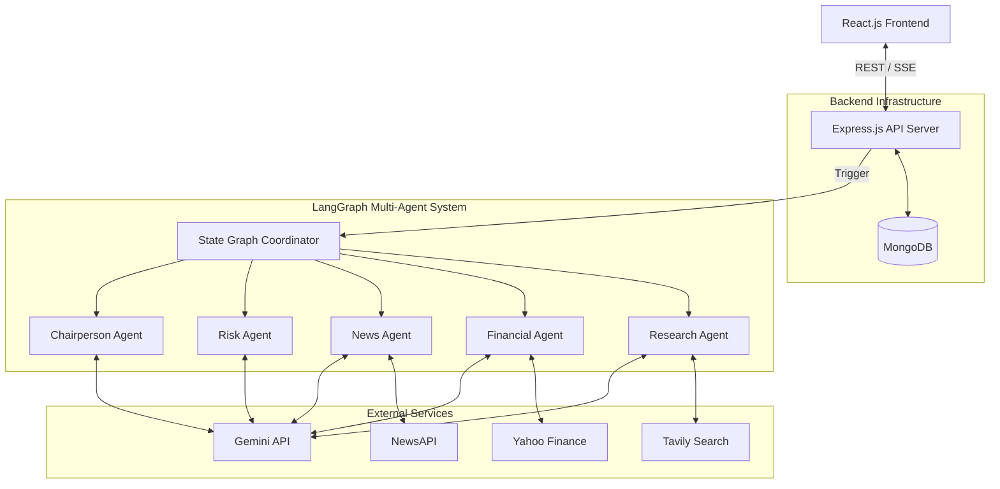

# AlphaLens AI: System Architecture

## 1. Architecture Overview
AlphaLens AI utilizes a modern, decoupled client-server architecture optimized for orchestrating complex AI workflows. The React.js frontend handles user interaction and streams real-time updates to keep the user engaged. The Node.js/Express.js backend serves as the secure API gateway, shielding API keys and housing the LangGraph state machine. LangGraph coordinates five distinct AI agents, which interact with external APIs (Yahoo Finance, NewsAPI, Tavily) to gather quantitative and qualitative data. The Gemini API provides the core LLM reasoning engine for these agents. Finally, MongoDB acts as a caching layer to store generated reports, saving API costs and dramatically reducing latency for repeat queries.

## 2. High-Level Architecture Diagram

## 3. Request Lifecycle
1. **User Input:** The user types a company ticker (e.g., "AAPL") into the React UI and clicks "Analyze".
2. **React Client:** Sends a `POST /api/analyze` request with the ticker to the Express backend.
3. **Express (Cache Check):** Queries MongoDB to check if a report for "AAPL" was generated in the last 24 hours. If a valid cache exists, it returns the report immediately, skipping step 4.
4. **LangGraph (Execution):** If no cache exists, Express initiates the LangGraph workflow and opens a Server-Sent Events (SSE) connection back to React to stream live agent status updates (e.g., "Fetching financials...").
5. **External APIs & Agents:**
    *   **Research Agent** verifies the ticker via Tavily.
    *   **Financial Agent** fetches market data via Yahoo Finance.
    *   **News Agent** pulls recent headlines via NewsAPI.
    *   **Risk Agent** reviews all gathered data to explicitly identify vulnerabilities.
    *   **Chairperson Agent** synthesizes the final report using Gemini.
6. **Database Write:** The Express server saves the final generated report payload into MongoDB.
7. **Client Render:** The SSE connection closes, the React frontend receives the final JSON payload, and renders the Markdown report to the user.

## 4. Component Responsibilities
*   **React Frontend:** Captures user input, handles UI state, displays the live "Agent Chatter" during loading, and renders the final Markdown report.
*   **Express Backend:** Acts as the API gateway, handles database caching, orchestrates the LangGraph state machine, and securely holds all external API keys.
*   **LangGraph:** Manages the internal "State", memory, and sequential routing between the different AI agents.
*   **Research Agent:** Validates the company name and provides a high-level corporate overview.
*   **Financial Agent:** Extracts and structures hard quantitative data (Current Price, P/E, Market Cap).
*   **News Agent:** Retrieves current market sentiment and recent qualitative events.
*   **Risk Agent:** Acts as the "Devil's Advocate," explicitly looking for headwinds, regulatory issues, or bearish signals.
*   **Chairperson Agent:** The final decision-maker. Weighs the Bull data (Financials/News) against the Bear data (Risk) to write the final recommendation.
*   **MongoDB:** Caches finished reports by ticker symbol and timestamp.
*   **External APIs:** Provide the raw ground-truth data (YF, News, Tavily) and the computational reasoning (Gemini).

## 5. Data Flow
*   **Client -> Server:** Ticker symbol (String).
*   **Server -> DB:** Ticker query. Returns cached Report (JSON) if found.
*   **Server -> LangGraph:** Initial State object containing the target Ticker.
*   **Agent -> Agent:** The LangGraph "State" object is passed sequentially. Each agent appends its findings (e.g., the Financial Agent appends a JSON block of metrics to the State).
*   **Agent -> Gemini:** System Prompt + Contextual State Data. Returns generated text.
*   **LangGraph -> Server:** The final State object containing the Chairperson's completed Markdown string and confidence score.
*   **Server -> Client (During Analysis):** SSE string events (e.g., `{"status": "Financial Agent running"}`).
*   **Server -> Client (Completion):** Full JSON payload containing the Markdown string, Data Citations, and Metadata.

## 6. Failure Handling
*   **Gemini fails:** The LangGraph node catches the LLM error, attempts 1 automatic retry, and if it still fails, returns a gracefully degraded state: "Analysis failed due to AI provider outage."
*   **Yahoo Finance fails:** The Financial Agent catches the API error and appends `{ error: "Data unavailable" }` to the state. The Chairperson Agent acknowledges this in the final report (e.g., "Note: Unable to retrieve current P/E...").
*   **News API fails:** The News Agent falls back to Tavily search. If both fail, it passes an empty array to the state, and the report notes the lack of recent news rather than hallucinating headlines.
*   **MongoDB fails:** The Express server gracefully catches the DB connection error, bypasses the cache check entirely, runs the live LangGraph analysis, and skips the final save—returning the live data directly to the user so the app remains fully functional.
*   **Research has insufficient evidence:** If no data is found for a ticker, the workflow short-circuits at the Research Agent, returning an immediate error to the user: "Ticker not found or invalid."

## 7. Scalability
While explicitly scoped for a 7-day internship project, the architecture is designed with enterprise scale in mind:
*   **Horizontal Scaling:** The Express backend is stateless (outside of the DB cache) and can be Dockerized and scaled horizontally across multiple instances (e.g., AWS ECS or Render).
*   **Async Message Queues:** For higher volume, the HTTP request could push a job to a Redis/BullMQ queue instead of waiting synchronously. This would allow the backend to process hundreds of simultaneous ticker requests without timing out.
*   **Agent Expansion:** LangGraph's modularity means adding an "SEC Filings Agent" or "Twitter Sentiment Agent" in the future requires adding only one new node to the graph, without rewriting the core orchestration logic.
