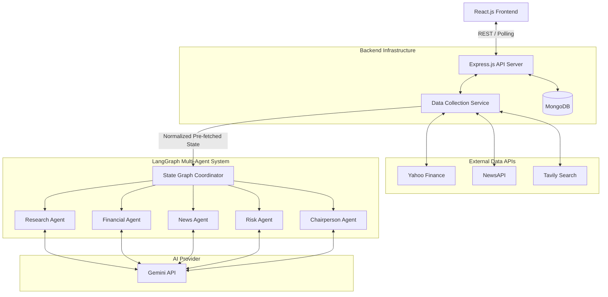

# AlphaLens AI: System Architecture

## 1. Architecture Overview
AlphaLens AI utilizes a decoupled architecture where data collection is strictly separated from AI reasoning. The Node.js/Express.js backend serves as an API gateway and Data Collection Service. It fetches raw data from external APIs (Yahoo Finance, NewsAPI, Tavily) in parallel, normalizes it, and passes it into LangGraph as a unified initial state. The LangGraph agents, powered by Gemini, act strictly as analytical reasoning engines that read the pre-fetched state. MongoDB caches the final structured JSON outputs.

## 2. High-Level Architecture Diagram

## 3. Request Lifecycle
1. **User Input:** User types a ticker into React.
2. **React Client:** Sends `POST /api/runs`.
3. **Express (Cache Check):** Checks MongoDB for a recent run.
4. **Data Collection Service:** Express executes parallel API calls to Yahoo Finance, NewsAPI, and Tavily. The data is normalized into `marketData`, `news`, and `company`.
5. **LangGraph (Execution):** Express initializes LangGraph with the pre-fetched data. The agents execute sequentially, relying only on the Gemini API to perform reasoning tasks on the provided data, updating the `agents` array in the state.
6. **Database Write:** Express saves the final state (including structured JSON `sections` and UI `agents` status) to MongoDB.
7. **Client Render:** React polls the status, receives the final JSON, and renders the `sections` directly as Markdown on the client side.

## 4. Component Responsibilities
*   **React Frontend:** Captures input, polls `/status`, renders UI from the structured `agents` array, and dynamically formats the Chairperson's JSON output into a visual Markdown report.
*   **Express Backend:** Acts as the API gateway and Data Collection Service. It abstracts away all external API complexity before LangGraph ever runs.
*   **LangGraph:** Responsible purely for state orchestration and sequential reasoning.
*   **Research Agent:** Analyzes `company` data to output `researchSummary`.
*   **Financial Agent:** Analyzes `marketData` to output `financialAnalysis`.
*   **News Agent:** Analyzes `news` to output `newsAnalysis`.
*   **Risk Agent:** Analyzes preceding outputs to formulate `riskAnalysis`.
*   **Chairperson Agent:** Synthesizes final JSON `recommendation`, `confidence`, `reasoning`, and `sections`.
*   **MongoDB:** Stores the runs, including `debugLogs` and the UI `agents` status.

## 5. Data Flow
*   **Client -> Server:** Ticker symbol.
*   **Server -> External APIs:** Fetch raw JSON data.
*   **Server -> LangGraph:** Inject `ticker`, `company`, `marketData`, `news`.
*   **Agent -> Gemini:** Pass data + analysis prompt.
*   **LangGraph -> Server:** Final state with structured analytical JSON.
*   **Server -> Client:** `agents` status array during processing; `report` JSON upon completion.

## 6. Failure Handling
*   **External API Fails (Pre-Graph):** If Express cannot fetch critical data (e.g., Yahoo Finance is down), it returns a 503 error to the client, preventing expensive LLM calls from starting.
*   **Gemini Fails:** The specific LangGraph node retries once, then fails, appending to `debugLogs`.
*   **MongoDB Fails:** Skips caching and executes a live run.

## 7. Scalability
By removing external API calls from the AI agents, the Data Collection Service can be independently scaled, load-balanced, or swapped with premium API providers (like Bloomberg) without changing a single line of LangGraph reasoning code.
