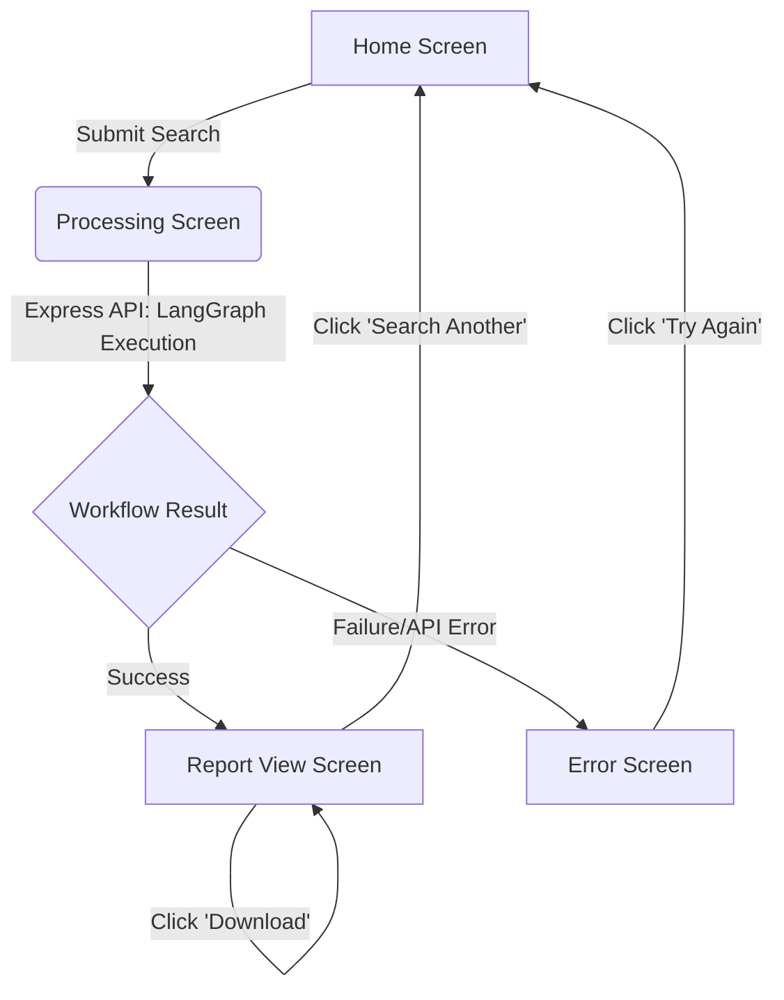

# AlphaLens AI: User Flow & UX Architecture

## 1. User Journey
The journey begins when the user lands on the AlphaLens AI web application. They are immediately presented with a clean, focused interface containing a single search bar. The user inputs the name or ticker symbol of a publicly listed company and initiates the search. 

Instead of a blank loading screen, the user is transitioned into a "Processing" experience where they watch real-time updates from multiple AI agents (Research, Financial, News, Risk, Chairperson) working sequentially to analyze the company. Once the multi-agent workflow concludes, the user is presented with a comprehensive, structured investment recommendation report. Finally, the user can read the insights, download the report for offline use, or return to the home screen to analyze another company.

## 2. Application Screens

### Screen 1: Home (Search) Screen
*   **Purpose:** Act as the entry point for the application, minimizing cognitive load and focusing the user strictly on the single call-to-action.
*   **Main Components:** Header/Logo, Hero text, Search input field, "Analyze" button, and 3-4 "Suggested Ticker" quick-links.
*   **Primary User Actions:** Type a company name/ticker, click a suggested ticker, or submit the search form.
*   **Possible Navigation:** Transitions to the Processing Screen upon submission.

### Screen 2: Processing (Agent Chatter) Screen
*   **Purpose:** Keep the user engaged during the 30-60 second LLM processing delay and visually demonstrate the complex LangGraph backend architecture.
*   **Main Components:** Target company header, live terminal/chat-style feed of agent statuses (e.g., "Risk Agent evaluating headwinds..."), and a visual progress indicator.
*   **Primary User Actions:** Observe the process (passive engagement).
*   **Possible Navigation:** Automatically routes to the Report Screen on success, or the Error Screen on failure.

### Screen 3: Report View Screen
*   **Purpose:** Present the final AI investment recommendation in a highly readable, standardized format.
*   **Main Components:** Stock price/data header, Markdown-rendered report sections (Overview, Bull Case, Bear Case, Verdict), "Download Report" button, and "Search Another" button.
*   **Primary User Actions:** Read the report, click download, or initiate a new search.
*   **Possible Navigation:** Routes back to the Home Screen.

### Screen 4: Error Screen
*   **Purpose:** Provide a graceful fallback when data APIs fail, rate limits are hit, or invalid tickers are entered.
*   **Main Components:** Friendly error illustration/icon, clear human-readable error message, and a "Try Again" button.
*   **Primary User Actions:** Read the error, click "Try Again".
*   **Possible Navigation:** Routes back to the Home Screen.

## 3. Screen States

### Home (Search) Screen
*   **Empty State:** Search bar is blank. "Analyze" button is disabled to prevent empty submissions. Suggested tickers are visible.
*   **Error State:** If the user enters special characters or numbers that don't match a ticker format, show an inline validation error (e.g., "Please enter a valid ticker symbol").

### Processing Screen
*   **Loading State:** The entire screen acts as the application's global loading state. Animations (like blinking cursors, pulsing text, or typing effects) indicate active background processing by the Express backend.

### Report View Screen
*   **Success State:** The report is fully rendered, UI is interactive, and download buttons are enabled.
*   **Empty State:** N/A (The application logic prevents the user from reaching this screen without a successful data payload).

## 4. Navigation Flow
The application follows a strictly linear, one-way flow. The user starts at Home, moves to Processing, and ends at the Report (or Error). From the Report or Error screens, the only navigational choice is to loop back to the Home screen. There are no side-menus, dashboards, or complex routing trees, ensuring the user is always funneled toward the core AI value proposition.

## 5. User Interaction Flow
1.  **Open Website:** User lands on the minimalist homepage.
2.  **Search Company:** User types a ticker (e.g., "NVDA") into the search bar and clicks "Analyze".
3.  **Run Analysis:** The React.js frontend sends a request to the Express.js backend API.
4.  **AI Agent Workflow:** User watches the Processing Screen as the LangGraph state machine executes (Data -> News -> Analyst -> Risk -> Chairperson).
5.  **Investment Report:** The workflow completes, and the user is presented with the structured Buy/Hold/Sell recommendation.
6.  **Download Report:** User clicks the "Download" button to save the analysis locally.

## 6. Mermaid Flow Diagram

## 7. UX Design Decisions

*   **Why each screen exists:** The minimal screen count is a deliberate choice for a 7-day project constraint. We only build what is strictly necessary to input data (Home), build anticipation (Processing), and consume results (Report).
*   **Why the workflow is simple:** A linear workflow prevents feature creep. By avoiding complex dashboards, user authentication, and historical watchlists, the engineering effort remains 100% focused on polishing the React.js UI and the Node.js/Express backend orchestration.
*   **How the design improves user trust:** LLMs are notorious for "black box" reasoning and hallucinations. By exposing the "Processing Screen" to show exactly which agent is executing (e.g., "Financial Agent fetching Yahoo Finance data"), the user understands the AI is relying on real data tools, not just guessing. This transparency builds immense trust and demonstrates strong product sense to technical interviewers.
